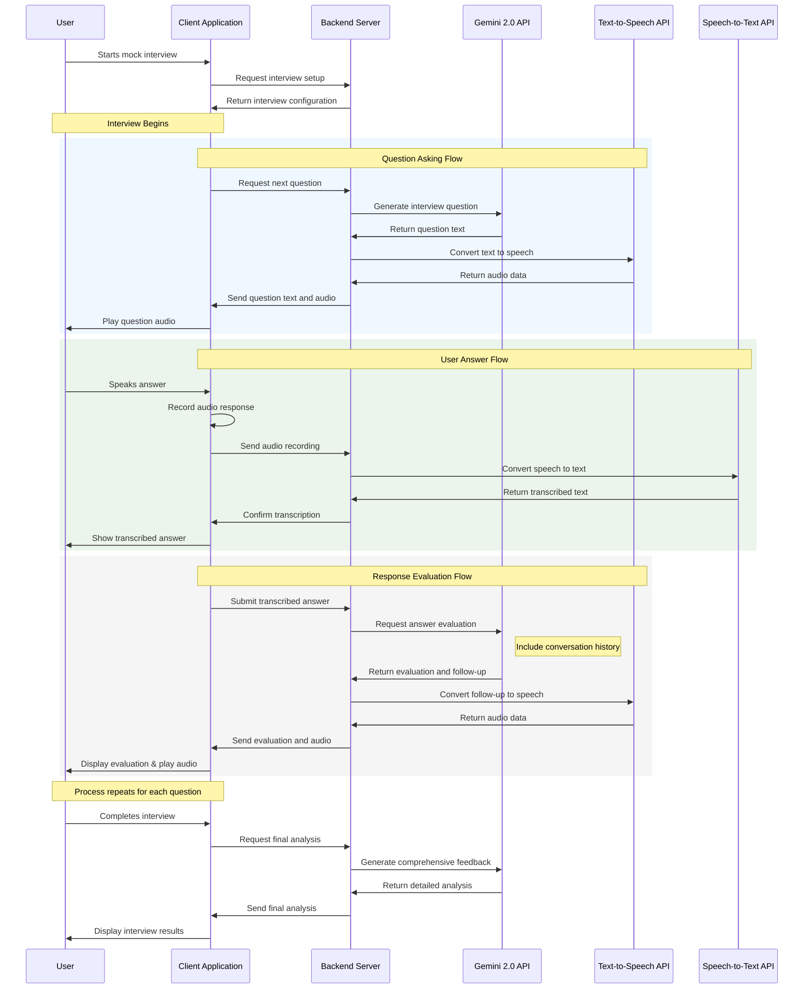

# Enhanced Mock Interview Simulation Feature Implementation Guide

## 1. Introduction

The Mock Interview Simulation Feature creates a fully immersive, verbal interview experience within the existing flashcard application by integrating Gemini 2.0 for question generation and evaluation. This feature aims to help users prepare for actual job interviews through a natural conversational interface that simulates real-world conditions, including verbal interactions, time constraints, and professional evaluation.

This document provides comprehensive guidance for implementing this feature, addressing all technical aspects from speech processing and cross-platform compatibility to error handling and performance optimization.

## 2. Prerequisites

### 2.1 Technical Requirements

- **Backend Framework**: Python with FastAPI (recommended for async support)
- **Frontend Framework**: Flutter (existing application)
- **API Services**:
  - Google Gemini 2.0 API access (gemini-2.0-flash and gemini-2.0-pro models)
  - Google Cloud Text-to-Speech API for verbal question delivery
  - Google Cloud Speech-to-Text API for capturing verbal user responses
  - Cloud storage for interview recordings (optional)
- **Audio Capabilities**:
  - Cross-platform audio recording and playback
  - Audio processing libraries for both client and server
- **State Management**:
  - Provider (or Riverpod/BLoC) for Flutter state management
- **Storage**:
  - Secure cloud storage for interview recordings (if saved)
  - Local database for user progress and settings

### 2.2 Development Environment Setup

1. **API Keys and Authentication**:
   ```bash
   # Set up environment variables for secure key storage
   export GEMINI_API_KEY="your_gemini_api_key"
   export GOOGLE_APPLICATION_CREDENTIALS="path_to_credentials.json"
   ```

2. **Local Development Environment**:
   ```bash
   # Backend dependencies
   pip install fastapi uvicorn google-generativeai google-cloud-texttospeech google-cloud-speech

   # Flutter setup (ensure Flutter 3.0+ is installed)
   flutter pub add provider
   flutter pub add just_audio
   flutter pub add record
   flutter pub add http
   ```

3. **Testing Utilities**:
   - Audio testing tools for verifying voice quality
   - Network monitoring for API call performance
   - Cross-platform compatibility testing tools

## 3. System Architecture

### 3.1 High-Level Architecture

```
┌─────────────────────────────────────────────────────────────┐
│                      Client Application                      │
│                                                             │
│  ┌───────────────┐   ┌───────────────┐   ┌───────────────┐  │
│  │ Setup Manager │   │  Interview UI │   │  Result View  │  │
│  └───────┬───────┘   └───────┬───────┘   └───────┬───────┘  │
│          │                   │                   │          │
│  ┌───────┴───────┐   ┌───────┴───────┐   ┌───────┴───────┐  │
│  │ Config Store  │   │ Audio Manager │   │ Progress Store│  │
│  └───────────────┘   └───────────────┘   └───────────────┘  │
└─────────────────────────────┬───────────────────────────────┘
                              │
                              │ API Calls
                              │
┌─────────────────────────────┴───────────────────────────────┐
│                        Backend Server                        │
│                                                             │
│  ┌────────────────┐  ┌────────────────┐  ┌────────────────┐ │
│  │Interview Manager│ │ Gemini Service │  │ Speech Services│ │
│  └────────┬───────┘  └────────┬───────┘  └────────┬───────┘ │
│           │                   │                   │         │
│  ┌────────┴───────┐  ┌────────┴───────┐  ┌────────┴───────┐ │
│  │  User Manager  │  │Content Generator│  │ Audio Processor│ │
│  └────────────────┘  └────────────────┘  └────────────────┘ │
└─────────────────────────────────────────────────────────────┘
```

### 3.2 Data Flow Diagram



## 4. Implementation Instructions

### 4.1 Backend Implementation

#### 4.1.1 FastAPI Setup with Async Support

```python
# main.py
import asyncio
import logging
from fastapi import FastAPI, HTTPException, BackgroundTasks
from fastapi.middleware.cors import CORSMiddleware
from pydantic import BaseModel
from typing import List, Dict, Optional, Any
import uvicorn

# Import our services
from services.gemini_service import GeminiService
from services.speech_service import TTSService, STTService

# Configure logging
logging.basicConfig(level=logging.INFO)
logger = logging.getLogger(__name__)

app = FastAPI(title="Interview Simulation API")

# Configure CORS
app.add_middleware(
    CORSMiddleware,
    allow_origins=["*"],  # Update with specific origins in production
    allow_credentials=True,
    allow_methods=["*"],
    allow_headers=["*"],
)

# Initialize services
gemini_service = GeminiService()
tts_service = TTSService()
stt_service = STTService()

# Define request/response models
class QuestionRequest(BaseModel):
    category: str
    difficulty: str
    previous_questions: List[str] = []
    conversation_history: List[Dict[str, str]] = []
    voice_config: Dict[str, Any] = {}
    model: str = "gemini-2.0-flash"

class TranscriptionRequest(BaseModel):
    audio_data: str  # Base64 encoded audio
    language_code: str = "en-US"

class AnswerEvaluationRequest(BaseModel):
    question: str
    answer: str
    category: str
    difficulty: str
    conversation_history: List[Dict[str, str]] = []
    voice_config: Dict[str, Any] = {}

@app.get("/health")
async def health_check():
    return {"status": "healthy"}

@app.post("/api/interview/question")
async def get_question(request: QuestionRequest, background_tasks: BackgroundTasks):
    """Generate an interview question with audio."""
    try:
        # Generate question text with Gemini
        question_text = await gemini_service.generate_interview_question(
            request.category,
            request.difficulty,
            request.previous_questions,
            request.conversation_history,
            request.model
        )
        
        # Generate audio in background to reduce response time
        # This is optional - you can make this synchronous if you prefer
        audio_task = background_tasks.add_task(
            tts_service.text_to_speech,
            question_text, 
            request.voice_config
        )
        
        # For immediate response without waiting for audio
        # In a real implementation, you'd use WebSockets to send the audio 
        # when it's ready or a polling mechanism
        return {
            "questionText": question_text,
            "audioStatus": "processing",
            "category": request.category,
            "difficulty": request.difficulty
        }
    except Exception as e:
        logger.error(f"Error generating question: {e}")
        raise HTTPException(
            status_code=500,
            detail=f"Failed to generate question: {str(e)}"
        )

@app.post("/api/interview/transcribe")
async def transcribe_audio(request: TranscriptionRequest):
    """Transcribe user's spoken answer."""
    try:
        transcribed_text = await stt_service.transcribe_audio(
            request.audio_data,
            request.language_code
        )
        return {"transcribedText": transcribed_text}
    except Exception as e:
        logger.error(f"Error transcribing audio: {e}")
        raise HTTPException(
            status_code=500,
            detail=f"Failed to transcribe audio: {str(e)}"
        )

@app.post("/api/interview/evaluate")
async def evaluate_answer(request: AnswerEvaluationRequest):
    """Evaluate user's answer and generate follow-up."""
    try:
        # Evaluate the answer with Gemini
        evaluation = await gemini_service.evaluate_answer(
            request.question,
            request.answer,
            request.category,
            request.difficulty,
            request.conversation_history
        )
        
        # Generate verbal feedback
        verbal_feedback = f"Thank you for your answer. {evaluation.get('feedback', '')} Here's my follow-up question: {evaluation.get('follow_up_question', '')}"
        
        # Convert feedback to speech
        audio_base64 = await tts_service.text_to_speech(verbal_feedback, request.voice_config)
        
        # Return evaluation with audio
        evaluation['audioContent'] = audio_base64
        return evaluation
    except Exception as e:
        logger.error(f"Error evaluating answer: {e}")
        raise HTTPException(
            status_code=500,
            detail=f"Failed to evaluate answer: {str(e)}"
        )

if __name__ == "__main__":
    uvicorn.run("main:app", host="0.0.0.0", port=8000, reload=True)
```

#### 4.1.2 Gemini Service Implementation with Context Management

```python
# services/gemini_service.py
import os
import json
import logging
import asyncio
import google.generativeai as genai
from typing import List, Dict, Any, Optional

# Configure logging
logger = logging.getLogger(__name__)

class GeminiService:
    def __init__(self):
        """Initialize the Gemini service with API key."""
        api_key = os.environ.get("GEMINI_API_KEY")
        if not api_key:
            raise ValueError("GEMINI_API_KEY environment variable not set")
        
        genai.configure(api_key=api_key)
        logger.info("Gemini service initialized")
        
    async def get_model(self, model_name: str = "gemini-2.0-flash"):
        """Returns appropriate Gemini model based on name."""
        if model_name == "gemini-2.0-pro":
            return genai.GenerativeModel('gemini-2.0-pro')
        else:  # Default to flash for speed
            return genai.GenerativeModel('gemini-2.0-flash')
    
    async def generate_interview_question(
        self, 
        category: str, 
        difficulty: str, 
        previous_questions: List[str] = None,
        conversation_history: List[Dict[str, str]] = None,
        model_name: str = "gemini-2.0-flash"
    ) -> str:
        """Generates a relevant interview question using Gemini with context awareness."""
        model = await self.get_model(model_name)
        
        # Build base prompt for question generation
        prompt = f"""
        You are an expert interviewer conducting a data science mock interview.
        Generate a challenging {difficulty} level question for the '{category}' category.
        
        The question should be direct and clear, phrased exactly as an interviewer would ask it verbally.
        Do not include any explanations, just return the question itself.
        """
        
        # Add conversation history context if available
        if conversation_history and len(conversation_history) > 0:
            context_prompt = "\n\nHere's the conversation history so far:\n"
            for exchange in conversation_history:
                if "question" in exchange:
                    context_prompt += f"Interviewer: {exchange['question']}\n"
                if "answer" in exchange:
                    # Include a brief summary to avoid huge prompts
                    answer_summary = exchange['answer'][:200] + "..." if len(exchange['answer']) > 200 else exchange['answer']
                    context_prompt += f"Candidate: {answer_summary}\n"
            
            prompt += context_prompt
            prompt += "\nBased on this conversation history, ask a relevant follow-up or a new question."
        
        # Add previous questions to avoid repetition
        if previous_questions and len(previous_questions) > 0:
            prompt += "\n\nAvoid these previously asked questions:"
            for q in previous_questions:
                prompt += f"\n- {q}"
        
        try:
            # Run in executor to avoid blocking the event loop
            loop = asyncio.get_event_loop()
            response = await loop.run_in_executor(
                None, 
                lambda: model.generate_content(prompt)
            )
            return response.text.strip()
        except Exception as e:
            logger.error(f"Error generating question with Gemini: {e}")
            # Fallback question if API fails
            return f"Can you explain your experience with {category} projects?"
    
    async def evaluate_answer(
        self, 
        question: str, 
        answer: str, 
        category: str, 
        difficulty: str,
        conversation_history: List[Dict[str, str]] = None
    ) -> Dict[str, Any]:
        """Evaluates the user's answer using Gemini with conversation context."""
        model = await self.get_model("gemini-2.0-pro")  # Use pro for detailed evaluation
        
        # Build base prompt for evaluation
        prompt = f"""
        You are an expert interviewer evaluating a candidate's response in a data science mock interview.
        
        Question: {question}
        Category: {category}
        Difficulty: {difficulty}
        
        Candidate's Answer: {answer}
        """
        
        # Add conversation history for context
        if conversation_history and len(conversation_history) > 0:
            context_prompt = "\n\nPrevious conversation context:\n"
            for exchange in conversation_history[-3:]:  # Include only recent exchanges to save tokens
                if "question" in exchange:
                    context_prompt += f"Interviewer: {exchange['question']}\n"
                if "answer" in exchange:
                    # Summarize long answers
                    answer_summary = exchange['answer'][:150] + "..." if len(exchange['answer']) > 150 else exchange['answer']
                    context_prompt += f"Candidate: {answer_summary}\n"
            
            prompt += context_prompt
        
        # Request structured response
        prompt += """
        Provide an evaluation in JSON format with the following fields:
        1. score (integer between 0-100)
        2. feedback (string with detailed evaluation)
        3. strengths (array of strings)
        4. improvements (array of strings)
        5. follow_up_question (string with a natural follow-up based on their answer)
        
        Format your response ONLY as valid JSON with no additional text.
        """
        
        try:
            # Run in executor to avoid blocking
            loop = asyncio.get_event_loop()
            response = await loop.run_in_executor(
                None, 
                lambda: model.generate_content(prompt)
            )
            
            # Parse the JSON response from Gemini
            eval_data = json.loads(response.text)
            return eval_data
        except json.JSONDecodeError as e:
            logger.error(f"Error parsing Gemini response as JSON: {e}. Response: {response.text}")
            # Return fallback with structured format and explicit follow-up
            return {
                "score": 50,
                "feedback": "We couldn't properly analyze your answer. The system encountered a processing error.",
                "strengths": ["Attempted to answer the question"],
                "improvements": ["Please try again with a more structured response"],
                "follow_up_question": "Could you elaborate more on your approach to this problem?"
            }
        except Exception as e:
            logger.error(f"Error evaluating answer with Gemini: {e}")
            # Return structured fallback with explicit follow-up
            return {
                "score": 50,
                "feedback": "We encountered a system error while analyzing your answer.",
                "strengths": ["Attempted to answer the question"],
                "improvements": ["System error occurred - please try again later"],
                "follow_up_question": "Despite the error, would you like to continue with the next question?"
            }
```

#### 4.1.3 Speech Services Implementation

```python
# services/speech_service.py
import os
import base64
import logging
import asyncio
from typing import Dict, Any, Optional
from google.cloud import texttospeech
from google.cloud import speech

# Configure logging
logger = logging.getLogger(__name__)

class TTSService:
    """Service for text-to-speech conversion."""
    
    def __init__(self):
        """Initialize the TTS client."""
        try:
            self.client = texttospeech.TextToSpeechClient()
            logger.info("TTS service initialized")
        except Exception as e:
            logger.error(f"Failed to initialize TTS service: {e}")
            raise
    
    async def text_to_speech(self, text: str, voice_config: Dict[str, Any] = None) -> str:
        """Convert text to speech and return as base64 encoded string."""
        if not voice_config:
            voice_config = {
                "language_code": "en-US",
                "voice_type": "MALE",
                "speaking_rate": 1.0,
                "audio_encoding": "MP3"
            }
        
        # Configure voice settings
        if voice_config.get("voice_type") == "FEMALE":
            ssml_gender = texttospeech.SsmlVoiceGender.FEMALE
        else:
            ssml_gender = texttospeech.SsmlVoiceGender.MALE
        
        # Determine audio encoding
        encoding_type = voice_config.get("audio_encoding", "MP3").upper()
        if encoding_type == "MP3":
            audio_encoding = texttospeech.AudioEncoding.MP3
        elif encoding_type == "WAV":
            audio_encoding = texttospeech.AudioEncoding.LINEAR16
        elif encoding_type == "OGG":
            audio_encoding = texttospeech.AudioEncoding.OGG_OPUS
        else:
            # Default to MP3
            audio_encoding = texttospeech.AudioEncoding.MP3
        
        # Set up the request
        input_text = texttospeech.SynthesisInput(text=text)
        voice = texttospeech.VoiceSelectionParams(
            language_code=voice_config.get("language_code", "en-US"),
            ssml_gender=ssml_gender,
            name=voice_config.get("voice_name", "")  # Optional specific voice
        )
        audio_config = texttospeech.AudioConfig(
            audio_encoding=audio_encoding,
            speaking_rate=voice_config.get("speaking_rate", 1.0),
            pitch=voice_config.get("pitch", 0.0),
            volume_gain_db=voice_config.get("volume_gain_db", 0.0)
        )
        
        try:
            # Run in executor to avoid blocking
            loop = asyncio.get_event_loop()
            response = await loop.run_in_executor(
                None,
                lambda: self.client.synthesize_speech(
                    input=input_text,
                    voice=voice,
                    audio_config=audio_config
                )
            )
            
            # Encode audio data as base64 for transmission
            audio_base64 = base64.b64encode(response.audio_content).decode('utf-8')
            return audio_base64
        except Exception as e:
            logger.error(f"Error synthesizing speech: {e}")
            return None


class STTService:
    """Service for speech-to-text conversion."""
    
    def __init__(self):
        """Initialize the STT client."""
        try:
            self.client = speech.SpeechClient()
            logger.info("STT service initialized")
        except Exception as e:
            logger.error(f"Failed to initialize STT service: {e}")
            raise
    
    async def transcribe_audio(self, audio_base64: str, language_code: str = "en-US") -> str:
        """Transcribe audio from base64 encoded string."""
        try:
            # Decode base64 audio
            audio_content = base64.b64decode(audio_base64)
            
            # Configure recognition settings
            config = speech.RecognitionConfig(
                encoding=speech.RecognitionConfig.AudioEncoding.WEBM_OPUS,
                sample_rate_hertz=48000,  # Adjust based on your recording settings
                language_code=language_code,
                enable_automatic_punctuation=True,
                model="latest_long",  # Use long form for interview answers
                use_enhanced=True  # Use enhanced model for better accuracy
            )
            
            audio = speech.RecognitionAudio(content=audio_content)
            
            # Run in executor to avoid blocking
            loop = asyncio.get_event_loop()
            response = await loop.run_in_executor(
                None,
                lambda: self.client.recognize(config=config, audio=audio)
            )
            
            # Process the response
            transcribed_text = ""
            for result in response.results:
                transcribed_text += result.alternatives[0].transcript
            
            return transcribed_text
        except Exception as e:
            logger.error(f"Error transcribing audio: {e}")
            return "Error transcribing audio. Please try again or type your answer."
```

### 4.2 Frontend Implementation

#### 4.2.1 Cross-Platform Audio Manager

```dart
// lib/services/cross_platform_audio_manager.dart
import 'dart:convert';
import 'dart:typed_data';
import 'package:flutter/foundation.dart';
import 'package:just_audio/just_audio.dart';
import 'package:record/record.dart';

/// Handles audio recording and playback across platforms (iOS, Android, Web, Desktop)
class CrossPlatformAudioManager {
  // Audio playback
  final AudioPlayer _audioPlayer = AudioPlayer();
  bool _isPlaying = false;
  
  // Audio recording
  final Record _audioRecorder = Record();
  bool _isRecording = false;
  String? _recordedPath;
  
  // Audio file format
  final AudioFormat _recordingFormat = AudioFormat.webm;  // or wav/mp3
  
  CrossPlatformAudioManager() {
    // Listen to player state changes
    _audioPlayer.playerStateStream.listen((state) {
      if (state.processingState == ProcessingState.completed) {
        _isPlaying = false;
      }
    });
  }
  
  /// Play audio from base64 string (for TTS output)
  Future<void> playAudioFromBase64(String base64Audio) async {
    if (_isPlaying) {
      await stopAudio();
    }
    
    try {
      _isPlaying = true;
      
      // Convert base64 to bytes
      final Uint8List audioBytes = base64Decode(base64Audio);
      
      // Create temporary source
      await _audioPlayer.setAudioSource(
        StreamAudioSource(
          (const Stream<List<int>>.empty()).cast<int>(),
          length: audioBytes.length,
          bytes: audioBytes,
        )
      );
      
      // Play audio
      await _audioPlayer.play();
    } catch (e) {
      debugPrint('Error playing audio: $e');
      _isPlaying = false;
      rethrow;
    }
  }
  
  /// Start recording user's answer
  Future<bool> startRecording() async {
    if (_isRecording) {
      return true;  // Already recording
    }
    
    // Check permissions
    if (!await _audioRecorder.hasPermission()) {
      debugPrint('Audio recording permission denied');
      return false;
    }
    
    try {
      // Configure recorder with platform-specific settings
      await _audioRecorder.start(
        encoder: _getAudioEncoder(),
        bitRate: 128000,
        samplingRate: 48000,
      );
      
      _isRecording = true;
      return true;
    } catch (e) {
      debugPrint('Error starting recording: $e');
      _isRecording = false;
      return false;
    }
  }
  
  /// Stop recording and return the file path
  Future<String?> stopRecording() async {
    if (!_isRecording) {
      return _recordedPath;  // Return last recorded path if available
    }
    
    try {
      _recordedPath = await _audioRecorder.stop();
      _isRecording = false;
      return _recordedPath;
    } catch (e) {
      debugPrint('Error stopping recording: $e');
      _isRecording = false;
      return null;
    }
  }
  
  /// Get recording as base64 string for API submission
  Future<String?> getRecordingAsBase64() async {
    if (_recordedPath == null) {
      return null;
    }
    
    try {
      // Read file as bytes
      final file = File(_recordedPath!);
      final bytes = await file.readAsBytes();
      
      // Convert to base64
      final base64Audio = base64Encode(bytes);
      return base64Audio;
    } catch (e) {
      debugPrint('Error encoding audio to base64: $e');
      return null;
    }
  }
  
  /// Stop audio playback
  Future<void> stopAudio() async {
    if (_isPlaying) {
      await _audioPlayer.stop();
      _isPlaying = false;
    }
  }
  
  /// Release resources
  Future<void> dispose() async {
    await _audioPlayer.dispose();
    await _audioRecorder.dispose();
  }
  
  /// Get appropriate audio encoder based on platform
  AudioEncoder _getAudioEncoder() {
    if (kIsWeb) {
      return AudioEncoder.opus;  // Best for web
    } else if (Platform.isIOS) {
      return AudioEncoder.aacLc;  // Best for iOS
    } else if (Platform.isAndroid) {
      return AudioEncoder.aacLc;  // Standard for Android
    } else {
      return AudioEncoder.wav;  // Default for desktop
    }
  }
  
  // Getters
  bool get isPlaying => _isPlaying;
  bool get isRecording => _isRecording;
}

/// Custom StreamAudioSource for playing bytes directly
class StreamAudioSource extends StreamAudioSource {
  final Uint8List bytes;
  final int? length;

  StreamAudioSource(Stream<int> stream, {required this.bytes, this.length})
      : super(stream);

  @override
  Future<StreamAudioResponse> request([int? start, int? end]) async {
    start ??= 0;
    end ??= length ?? bytes.length;
    return StreamAudioResponse(
      sourceLength: length ?? bytes.length,
      contentLength: end - start,
      offset: start,
      stream: Stream.value(bytes.sublist(start, end)),
      contentType: 'audio/mpeg',
    );
  }
}
```

#### 4.2.2 Interview Service with Error Handling

```dart
// lib/services/interview_service.dart
import 'dart:convert';
import 'dart:io';
import 'package:flutter/foundation.dart';
import 'package:http/http.dart' as http;

class InterviewService extends ChangeNotifier {
  final String baseUrl;
  
  // Error state handling
  bool _hasError = false;
  String _errorMessage = '';
  bool _isLoading = false;
  
  // Retry configurations
  static const int _maxRetries = 3;
  static const Duration _retryDelay = Duration(seconds: 1);
  
  // Request timeouts
  static const Duration _requestTimeout = Duration(seconds: 20);
  
  InterviewService({this.baseUrl = 'http://localhost:8000/api'});
  
  /// Get next interview question with error handling and retries
  Future<Map<String, dynamic>?> getQuestion({
    String category = 'technical',
    String difficulty = 'mid',
    List<String> previousQuestions = const [],
    List<Map<String, dynamic>> conversationHistory = const [],
    Map<String, dynamic>? voiceConfig,
    String model = 'gemini-2.0-flash'
  }) async {
    _setLoading(true);
    _clearError();
    
    // Retry counter
    int attempts = 0;
    
    while (attempts < _maxRetries) {
      try {
        final response = await http.post(
          Uri.parse('$baseUrl/interview/question'),
          headers: {'Content-Type': 'application/json'},
          body: jsonEncode({
            'category': category,
            'difficulty': difficulty,
            'previous_questions': previousQuestions,
            'conversation_history': conversationHistory,
            'voice_config': voiceConfig ?? _getDefaultVoiceConfig(),
            'model': model
          })
        ).timeout(_requestTimeout);
        
        _setLoading(false);
        
        if (response.statusCode == 200) {
          return jsonDecode(response.body);
        } else {
          _setError('Server error: ${response.statusCode}');
          // Log the error response
          debugPrint('API Error: ${response.body}');
          
          // For certain status codes, don't retry
          if (response.statusCode == 401 || response.statusCode == 403) {
            return null;  // Authentication errors won't be fixed by retrying
          }
        }
      } on SocketException catch (e) {
        _setError('Network error: ${e.message}');
        debugPrint('Network error: $e');
      } on TimeoutException catch (_) {
        _setError('Request timed out. Please check your connection.');
        debugPrint('Request timed out');
      } catch (e) {
        _setError('Unexpected error: $e');
        debugPrint('Unexpected error: $e');
      }
      
      // Increment attempt counter
      attempts++;
      
      // If we have more attempts left, wait before retrying
      if (attempts < _maxRetries) {
        await Future.delayed(_retryDelay * attempts);
      }
    }
    
    _setLoading(false);
    return null;  // All attempts failed
  }
  
  /// Transcribe recorded audio into text
  Future<String?> transcribeAudio(String audioBase64, String languageCode) async {
    _setLoading(true);
    _clearError();
    
    try {
      final response = await http.post(
        Uri.parse('$baseUrl/interview/transcribe'),
        headers: {'Content-Type': 'application/json'},
        body: jsonEncode({
          'audio_data': audioBase64,
          'language_code': languageCode
        })
      ).timeout(_requestTimeout);
      
      _setLoading(false);
      
      if (response.statusCode == 200) {
        final data = jsonDecode(response.body);
        return data['transcribedText'];
      } else {
        _setError('Failed to transcribe audio: ${response.statusCode}');
        return null;
      }
    } catch (e) {
      _setLoading(false);
      _setError('Error transcribing audio: $e');
      return null;
    }
  }
  
  /// Submit answer for evaluation with retry logic
  Future<Map<String, dynamic>?> evaluateAnswer({
    required String question,
    required String answer,
    required String category,
    required String difficulty,
    List<Map<String, dynamic>> conversationHistory = const [],
    Map<String, dynamic>? voiceConfig,
  }) async {
    _setLoading(true);
    _clearError();
    
    // Retry counter
    int attempts = 0;
    
    while (attempts < _maxRetries) {
      try {
        final response = await http.post(
          Uri.parse('$baseUrl/interview/evaluate'),
          headers: {'Content-Type': 'application/json'},
          body: jsonEncode({
            'question': question,
            'answer': answer,
            'category': category,
            'difficulty': difficulty,
            'conversation_history': conversationHistory,
            'voice_config': voiceConfig ?? _getDefaultVoiceConfig()
          })
        ).timeout(_requestTimeout);
        
        _setLoading(false);
        
        if (response.statusCode == 200) {
          return jsonDecode(response.body);
        } else {
          _setError('Evaluation failed: ${response.statusCode}');
          debugPrint('API Error: ${response.body}');
        }
      } catch (e) {
        debugPrint('Error evaluating answer: $e');
      }
      
      // Increment attempt counter
      attempts++;
      
      // If we have more attempts left, wait before retrying
      if (attempts < _maxRetries) {
        await Future.delayed(_retryDelay * attempts);
      }
    }
    
    _setLoading(false);
    return null;  // All attempts failed
  }
  
  /// Get default voice configuration
  Map<String, dynamic> _getDefaultVoiceConfig() {
    return {
      'language_code': 'en-US',
      'voice_type': 'MALE',
      'speaking_rate': 1.0,
      'audio_encoding': 'MP3'
    };
  }
  
  // Error handling methods
  void _setLoading(bool loading) {
    _isLoading = loading;
    notifyListeners();
  }
  
  void _setError(String message) {
    _hasError = true;
    _errorMessage = message;
    notifyListeners();
  }
  
  void _clearError() {
    _hasError = false;
    _errorMessage = '';
    notifyListeners();
  }
  
  // Getters
  bool get hasError => _hasError;
  String get errorMessage => _errorMessage;
  bool get isLoading => _isLoading;
}
```

#### 4.2.3 Provider-Based State Management

```dart
// lib/providers/interview_provider.dart
import 'package:flutter/foundation.dart';
import '../models/interview_question.dart';
import '../models/interview_answer.dart';
import '../services/interview_service.dart';
import '../services/cross_platform_audio_manager.dart';

class InterviewProvider extends ChangeNotifier {
  final InterviewService _interviewService;
  final CrossPlatformAudioManager _audioManager;
  
  // State variables
  bool _isLoading = false;
  bool _isAiSpeaking = false;
  bool _isRecording = false;
  bool _isTranscribing = false;
  bool _hasError = false;
  String _errorMessage = '';
  
  // Interview session data
  InterviewQuestion? _currentQuestion;
  List<InterviewQuestion> _questions = [];
  List<String> _previousQuestionTexts = [];
  List<Map<String, dynamic>> _conversationHistory = [];
  int _currentQuestionIndex = 0;
  
  // User response data
  String _currentAnswerText = '';
  List<InterviewAnswer> _answers = [];
  
  // Settings
  String _selectedCategory = 'technical';
  String _selectedDifficulty = 'mid';
  Map<String, dynamic> _voiceConfig = {
    'language_code': 'en-US',
    'voice_type': 'MALE',
    'speaking_rate': 1.0
  };
  String _geminiModel = 'gemini-2.0-flash';
  
  InterviewProvider({
    required InterviewService interviewService,
    required CrossPlatformAudioManager audioManager
  }) : 
    _interviewService = interviewService,
    _audioManager = audioManager;
  
  /// Initialize a new interview session
  Future<void> initializeInterview({
    required String category,
    required String difficulty,
    required Map<String, dynamic> voiceConfig,
    required String model
  }) async {
    _isLoading = true;
    notifyListeners();
    
    // Update settings
    _selectedCategory = category;
    _selectedDifficulty = difficulty;
    _voiceConfig = voiceConfig;
    _geminiModel = model;
    
    // Reset session data
    _questions = [];
    _previousQuestionTexts = [];
    _conversationHistory = [];
    _answers = [];
    _currentQuestionIndex = 0;
    
    // Fetch first question
    await fetchNextQuestion();
  }
  
  /// Fetch the next interview question
  Future<void> fetchNextQuestion() async {
    _isLoading = true;
    _hasError = false;
    notifyListeners();
    
    try {
      final questionData = await _interviewService.getQuestion(
        category: _selectedCategory,
        difficulty: _selectedDifficulty,
        previousQuestions: _previousQuestionTexts,
        conversationHistory: _conversationHistory,
        voiceConfig: _voiceConfig,
        model: _geminiModel
      );
      
      if (questionData != null) {
        // Create question object
        final question = InterviewQuestion(
          id: DateTime.now().millisecondsSinceEpoch.toString(),
          text: questionData['questionText'],
          category: _selectedCategory,
          subtopic: questionData['subtopic'] ?? 'General',
          difficulty: _selectedDifficulty,
        );
        
        // Update state
        _currentQuestion = question;
        _questions.add(question);
        _previousQuestionTexts.add(question.text);
        _conversationHistory.add({'question': question.text});
        
        // Play audio if available
        if (questionData['audioContent'] != null) {
          playQuestionAudio(questionData['audioContent']);
        }
      } else if (_interviewService.hasError) {
        _hasError = true;
        _errorMessage = _interviewService.errorMessage;
      } else {
        _hasError = true;
        _errorMessage = 'Failed to fetch question. Please try again.';
      }
    } catch (e) {
      _hasError = true;
      _errorMessage = 'Unexpected error: $e';
      debugPrint('Error in fetchNextQuestion: $e');
    } finally {
      _isLoading = false;
      notifyListeners();
    }
  }
  
  /// Play question audio
  Future<void> playQuestionAudio(String audioBase64) async {
    _isAiSpeaking = true;
    notifyListeners();
    
    try {
      await _audioManager.playAudioFromBase64(audioBase64);
    } catch (e) {
      debugPrint('Error playing audio: $e');
    } finally {
      _isAiSpeaking = false;
      notifyListeners();
    }
  }
  
  /// Start recording user's answer
  Future<bool> startRecording() async {
    final success = await _audioManager.startRecording();
    if (success) {
      _isRecording = true;
      notifyListeners();
    } else {
      _hasError = true;
      _errorMessage = 'Failed to start recording. Please check your microphone permissions.';
      notifyListeners();
    }
    return success;
  }
  
  /// Stop recording and transcribe
  Future<void> stopRecordingAndTranscribe() async {
    // Stop recording
    final recordingPath = await _audioManager.stopRecording();
    _isRecording = false;
    notifyListeners();
    
    if (recordingPath == null) {
      _hasError = true;
      _errorMessage = 'Recording failed or was cancelled.';
      notifyListeners();
      return;
    }
    
    // Get audio as base64
    _isTranscribing = true;
    notifyListeners();
    
    final audioBase64 = await _audioManager.getRecordingAsBase64();
    if (audioBase64 == null) {
      _isTranscribing = false;
      _hasError = true;
      _errorMessage = 'Failed to process recording.';
      notifyListeners();
      return;
    }
    
    // Transcribe audio
    final transcribedText = await _interviewService.transcribeAudio(
      audioBase64, 
      _voiceConfig['language_code'] ?? 'en-US'
    );
    
    if (transcribedText != null && transcribedText.isNotEmpty) {
      _currentAnswerText = transcribedText;
    } else {
      _hasError = true;
      _errorMessage = 'Failed to transcribe your answer. Please try again or type your answer.';
    }
    
    _isTranscribing = false;
    notifyListeners();
  }
  
  /// Update current answer text (for typed input)
  void updateAnswerText(String text) {
    _currentAnswerText = text;
    notifyListeners();
  }
  
  /// Submit current answer for evaluation
  Future<void> submitAnswer() async {
    if (_currentQuestion == null || _currentAnswerText.isEmpty) {
      _hasError = true;
      _errorMessage = 'Please provide an answer before submitting.';
      notifyListeners();
      return;
    }
    
    _isLoading = true;
    notifyListeners();
    
    try {
      // Update conversation history
      _conversationHistory.add({'answer': _currentAnswerText});
      
      // Call evaluation API
      final evaluation = await _interviewService.evaluateAnswer(
        question: _currentQuestion!.text,
        answer: _currentAnswerText,
        category: _selectedCategory,
        difficulty: _selectedDifficulty,
        conversationHistory: _conversationHistory,
        voiceConfig: _voiceConfig
      );
      
      if (evaluation != null) {
        // Create answer object
        final answer = InterviewAnswer(
          questionId: _currentQuestion!.id,
          questionText: _currentQuestion!.text,
          userAnswer: _currentAnswerText,
          category: _selectedCategory,
          difficulty: _selectedDifficulty,
          score: evaluation['score'],
          feedback: evaluation['feedback'],
          suggestions: List<String>.from(evaluation['suggestions'] ?? [])
        );
        
        // Update answers list
        _answers.add(answer);
        
        // Play feedback audio if available
        if (evaluation['audioContent'] != null) {
          await playFeedbackAudio(evaluation['audioContent']);
        }
        
        // Move to next question or results screen
        if (_currentQuestionIndex < _questions.length - 1) {
          _currentQuestionIndex++;
          _currentQuestion = _questions[_currentQuestionIndex];
          _currentAnswerText = '';
        } else {
          // Ready for next question or completion
        }
      } else {
        _hasError = true;
        _errorMessage = 'Failed to evaluate your answer. Please try again.';
      }
    } catch (e) {
      _hasError = true;
      _errorMessage = 'Error submitting answer: $e';
    } finally {
      _isLoading = false;
      notifyListeners();
    }
  }
  
  /// Play feedback audio
  Future<void> playFeedbackAudio(String audioBase64) async {
    _isAiSpeaking = true;
    notifyListeners();
    
    try {
      await _audioManager.playAudioFromBase64(audioBase64);
    } catch (e) {
      debugPrint('Error playing feedback audio: $e');
    } finally {
      _isAiSpeaking = false;
      notifyListeners();
    }
  }
  
  /// Clear current error
  void clearError() {
    _hasError = false;
    _errorMessage = '';
    notifyListeners();
  }
  
  /// Clean up resources
  void dispose() {
    _audioManager.dispose();
    super.dispose();
  }
  
  // Getters
  bool get isLoading => _isLoading;
  bool get isAiSpeaking => _isAiSpeaking;
  bool get isRecording => _isRecording;
  bool get isTranscribing => _isTranscribing;
  bool get hasError => _hasError;
  String get errorMessage => _errorMessage;
  InterviewQuestion? get currentQuestion => _currentQuestion;
  String get currentAnswerText => _currentAnswerText;
  List<InterviewQuestion> get questions => _questions;
  List<InterviewAnswer> get answers => _answers;
  int get currentQuestionIndex => _currentQuestionIndex;
  int get totalQuestions => _questions.length;
  bool get isLastQuestion => _currentQuestionIndex >= _questions.length - 1;
}
```

#### 4.2.4 Interview Screen with Speech-to-Text

```dart
// lib/screens/interview_practice_screen.dart
import 'package:flutter/material.dart';
import 'package:provider/provider.dart';
import '../providers/interview_provider.dart';
import '../widgets/error_dialog.dart';
import '../widgets/audio_status_indicator.dart';

class InterviewPracticeScreen extends StatefulWidget {
  const InterviewPracticeScreen({Key? key}) : super(key: key);

  @override
  _InterviewPracticeScreenState createState() => _InterviewPracticeScreenState();
}

class _InterviewPracticeScreenState extends State<InterviewPracticeScreen> {
  // Timer variables
  late Timer _timer;
  int _remainingTime = 120; // 2 minutes default
  
  // Text controller for manual typing
  final TextEditingController _answerController = TextEditingController();
  
  @override
  void initState() {
    super.initState();
    _startTimer();
    
    // Update controller when answer changes
    final provider = Provider.of<InterviewProvider>(context, listen: false);
    _answerController.text = provider.currentAnswerText;
  }
  
  @override
  void dispose() {
    _timer.cancel();
    _answerController.dispose();
    super.dispose();
  }
  
  void _startTimer() {
    _timer = Timer.periodic(const Duration(seconds: 1), (timer) {
      if (_remainingTime > 0) {
        setState(() {
          _remainingTime--;
        });
      } else {
        _timer.cancel();
        // Optionally auto-submit when time expires
      }
    });
  }
  
  String _formatTime(int seconds) {
    final minutes = seconds ~/ 60;
    final remainingSeconds = seconds % 60;
    return '${minutes.toString().padLeft(2, '0')}:${remainingSeconds.toString().padLeft(2, '0')}';
  }

  @override
  Widget build(BuildContext context) {
    return Consumer<InterviewProvider>(
      builder: (context, provider, child) {
        // Show error dialog if needed
        if (provider.hasError) {
          WidgetsBinding.instance.addPostFrameCallback((_) {
            showDialog(
              context: context,
              builder: (context) => ErrorDialog(
                message: provider.errorMessage,
                onDismiss: () => provider.clearError(),
              ),
            );
          });
        }
        
        return Scaffold(
          appBar: AppBar(
            title: Text('Interview Practice'),
            actions: [
              // Timer display
              Center(
                child: Container(
                  padding: EdgeInsets.symmetric(horizontal: 12, vertical: 4),
                  decoration: BoxDecoration(
                    color: _remainingTime > 30 
                        ? Colors.green.withOpacity(0.2) 
                        : Colors.red.withOpacity(0.2),
                    borderRadius: BorderRadius.circular(16),
                  ),
                  child: Text(
                    _formatTime(_remainingTime),
                    style: TextStyle(
                      fontWeight: FontWeight.bold,
                      color: _remainingTime > 30 ? Colors.green : Colors.red,
                    ),
                  ),
                ),
              ),
              SizedBox(width: 16),
            ],
          ),
          body: provider.isLoading
              ? Center(child: CircularProgressIndicator())
              : _buildInterviewContent(provider),
        );
      },
    );
  }
  
  Widget _buildInterviewContent(InterviewProvider provider) {
    final currentQuestion = provider.currentQuestion;
    
    if (currentQuestion == null) {
      return Center(child: Text('No question available.'));
    }
    
    return Column(
      children: [
        // Question card with audio status
        Card(
          margin: EdgeInsets.all(16),
          child: Padding(
            padding: EdgeInsets.all(16),
            child: Column(
              crossAxisAlignment: CrossAxisAlignment.start,
              children: [
                // Audio status indicator
                AudioStatusIndicator(
                  isAiSpeaking: provider.isAiSpeaking,
                  isRecording: provider.isRecording,
                  isTranscribing: provider.isTranscribing,
                ),
                
                SizedBox(height: 12),
                
                // Question display
                Text(
                  currentQuestion.text,
                  style: TextStyle(fontSize: 18, fontWeight: FontWeight.bold),
                ),
                
                SizedBox(height: 8),
                
                // Question metadata
                Row(
                  children: [
                    _buildCategoryChip(currentQuestion.category),
                    SizedBox(width: 8),
                    _buildDifficultyChip(currentQuestion.difficulty),
                  ],
                ),
                
                // Progress indicator
                SizedBox(height: 12),
                LinearProgressIndicator(
                  value: (provider.currentQuestionIndex + 1) / 
                        (provider.totalQuestions > 0 ? provider.totalQuestions : 1),
                  backgroundColor: Colors.grey.shade200,
                ),
                SizedBox(height: 4),
                Text(
                  'Question ${provider.currentQuestionIndex + 1}/${provider.totalQuestions}',
                  style: TextStyle(fontSize: 12, color: Colors.grey.shade600),
                ),
              ],
            ),
          ),
        ),
        
        // Answer section
        Expanded(
          child: Padding(
            padding: EdgeInsets.all(16),
            child: Column(
              crossAxisAlignment: CrossAxisAlignment.start,
              children: [
                Text(
                  'Your Answer:',
                  style: TextStyle(fontWeight: FontWeight.bold, fontSize: 16),
                ),
                
                SizedBox(height: 8),
                
                // Typing area with transcribed text
                Expanded(
                  child: TextField(
                    controller: _answerController,
                    maxLines: null,
                    expands: true,
                    decoration: InputDecoration(
                      hintText: 'Type or speak your answer...',
                      border: OutlineInputBorder(),
                      filled: true,
                      fillColor: Colors.white,
                    ),
                    onChanged: (text) => provider.updateAnswerText(text),
                  ),
                ),
                
                // Action buttons
                Padding(
                  padding: EdgeInsets.symmetric(vertical: 16),
                  child: Row(
                    mainAxisAlignment: MainAxisAlignment.spaceAround,
                    children: [
                      // Record answer button
                      ElevatedButton.icon(
                        onPressed: provider.isRecording
                            ? () => provider.stopRecordingAndTranscribe()
                            : () => provider.startRecording(),
                        icon: Icon(provider.isRecording ? Icons.stop : Icons.mic),
                        label: Text(provider.isRecording ? 'Stop Recording' : 'Speak Answer'),
                        style: ElevatedButton.styleFrom(
                          backgroundColor: provider.isRecording
                              ? Colors.red
                              : Theme.of(context).primaryColor,
                        ),
                      ),
                      
                      // Submit button
                      ElevatedButton.icon(
                        onPressed: _answerController.text.isNotEmpty
                            ? () => provider.submitAnswer()
                            : null,
                        icon: Icon(Icons.send),
                        label: Text('Submit Answer'),
                        style: ElevatedButton.styleFrom(
                          backgroundColor: Colors.green,
                        ),
                      ),
                    ],
                  ),
                ),
              ],
            ),
          ),
        ),
      ],
    );
  }
  
  Widget _buildCategoryChip(String category) {
    return Container(
      padding: EdgeInsets.symmetric(horizontal: 8, vertical: 4),
      decoration: BoxDecoration(
        color: _getCategoryColor(category).withOpacity(0.2),
        borderRadius: BorderRadius.circular(12),
      ),
      child: Text(
        _getCategoryDisplayName(category),
        style: TextStyle(
          fontSize: 12,
          color: _getCategoryColor(category),
          fontWeight: FontWeight.bold,
        ),
      ),
    );
  }
  
  Widget _buildDifficultyChip(String difficulty) {
    return Container(
      padding: EdgeInsets.symmetric(horizontal: 8, vertical: 4),
      decoration: BoxDecoration(
        color: _getDifficultyColor(difficulty).withOpacity(0.2),
        borderRadius: BorderRadius.circular(12),
      ),
      child: Text(
        _getDifficultyDisplayName(difficulty),
        style: TextStyle(
          fontSize: 12,
          color: _getDifficultyColor(difficulty),
          fontWeight: FontWeight.bold,
        ),
      ),
    );
  }
  
  // Helper methods
  Color _getCategoryColor(String category) {
    switch (category) {
      case 'technical': return Colors.blue;
      case 'applied': return Colors.green;
      case 'case': return Colors.purple;
      case 'behavioral': return Colors.orange;
      default: return Colors.grey;
    }
  }
  
  String _getCategoryDisplayName(String category) {
    switch (category) {
      case 'technical': return 'Technical';
      case 'applied': return 'Applied';
      case 'case': return 'Case Study';
      case 'behavioral': return 'Behavioral';
      default: return category.toUpperCase();
    }
  }
  
  Color _getDifficultyColor(String difficulty) {
    switch (difficulty) {
      case 'entry': return Colors.green;
      case 'mid': return Colors.orange;
      case 'senior': return Colors.red;
      default: return Colors.grey;
    }
  }
  
  String _getDifficultyDisplayName(String difficulty) {
    switch (difficulty) {
      case 'entry': return 'Entry Level';
      case 'mid': return 'Mid Level';
      case 'senior': return 'Senior Level';
      default: return difficulty.toUpperCase();
    }
  }
}
```

#### 4.2.5 Audio Status Indicator Widget

```dart
// lib/widgets/audio_status_indicator.dart
import 'package:flutter/material.dart';

class AudioStatusIndicator extends StatelessWidget {
  final bool isAiSpeaking;
  final bool isRecording;
  final bool isTranscribing;
  
  const AudioStatusIndicator({
    Key? key,
    required this.isAiSpeaking,
    required this.isRecording,
    required this.isTranscribing,
  }) : super(key: key);

  @override
  Widget build(BuildContext context) {
    if (isAiSpeaking) {
      return _buildStatusBadge(
        icon: Icons.volume_up,
        text: 'AI is speaking...',
        color: Colors.blue,
      );
    } else if (isRecording) {
      return _buildStatusBadge(
        icon: Icons.mic,
        text: 'Recording your answer...',
        color: Colors.red,
        pulsating: true,
      );
    } else if (isTranscribing) {
      return _buildStatusBadge(
        icon: Icons.text_fields,
        text: 'Converting speech to text...',
        color: Colors.orange,
      );
    } else {
      return SizedBox.shrink(); // No status to display
    }
  }
  
  Widget _buildStatusBadge({
    required IconData icon,
    required String text,
    required Color color,
    bool pulsating = false,
  }) {
    return Container(
      padding: EdgeInsets.symmetric(horizontal: 12, vertical: 6),
      decoration: BoxDecoration(
        color: color.withOpacity(0.1),
        borderRadius: BorderRadius.circular(16),
        border: Border.all(color: color.withOpacity(0.3)),
      ),
      child: Row(
        mainAxisSize: MainAxisSize.min,
        children: [
          if (pulsating)
            _PulsatingDot(color: color)
          else
            Icon(icon, size: 16, color: color),
          SizedBox(width: 8),
          Text(
            text,
            style: TextStyle(
              fontSize: 14,
              color: color,
              fontWeight: FontWeight.w500,
            ),
          ),
        ],
      ),
    );
  }
}

class _PulsatingDot extends StatefulWidget {
  final Color color;
  
  const _PulsatingDot({Key? key, required this.color}) : super(key: key);

  @override
  _PulsatingDotState createState() => _PulsatingDotState();
}

class _PulsatingDotState extends State<_PulsatingDot> with SingleTickerProviderStateMixin {
  late AnimationController _controller;
  late Animation<double> _animation;
  
  @override
  void initState() {
    super.initState();
    _controller = AnimationController(
      duration: const Duration(milliseconds: 1000),
      vsync: this,
    )..repeat(reverse: true);
    _animation = Tween<double>(begin: 1.0, end: 1.5).animate(
      CurvedAnimation(parent: _controller, curve: Curves.easeInOut),
    );
  }
  
  @override
  void dispose() {
    _controller.dispose();
    super.dispose();
  }

  @override
  Widget build(BuildContext context) {
    return AnimatedBuilder(
      animation: _animation,
      builder: (context, child) {
        return Container(
          width: 10,
          height: 10,
          decoration: BoxDecoration(
            shape: BoxShape.circle,
            color: widget.color,
          ),
        );
      },
    );
  }
}
```

## 5. Required Functionality

### 5.1 Core Functional Requirements

1. **Verbal Question Delivery**:
   - AI-generated contextually relevant questions
   - Natural-sounding voice output from TTS service
   - Visual indicators for active speaking
   - Voice customization (gender, speaking rate, style)

2. **Speech-to-Text Response Capture**:
   - Real-time recording of user's verbal responses
   - Transcription of speech to text
   - Display of transcribed text with edit option
   - Alternative text input for accessibility

3. **Context-Aware Question Generation**:
   - Conversation history tracking for context
   - Follow-up questions based on previous answers
   - Question variety and non-repetition logic
   - Difficulty adaptation based on performance

4. **AI Evaluation**:
   - Detailed scoring and feedback
   - Identification of strengths and weaknesses
   - Relevant improvement suggestions
   - Verbal feedback delivery via TTS

5. **Cross-Platform Audio Support**:
   - Web, iOS, Android, and desktop compatibility
   - Platform-specific audio recording configuration
   - Uniform audio playback experience
   - Audio quality optimization

6. **Error Handling and Recovery**:
   - Graceful degradation on API failures
   - Connectivity monitoring and retry logic
   - User-friendly error messages
   - Alternate paths when audio features unavailable

7. **Interview Configuration**:
   - Role and industry selection
   - Difficulty level adjustment
   - Voice preferences customization
   - Interview length control

### 5.2 Non-Functional Requirements

1. **Performance**:
   - Audio playback with < 1 second latency
   - Speech recognition within 2-3 seconds
   - Smooth UI transitions during processing
   - Optimized API usage to minimize costs

2. **Reliability**:
   - 99.5% transcription accuracy for clear speech
   - Error recovery for network interruptions
   - Automatic retry for failed API calls
   - State persistence during unexpected closures

3. **Accessibility**:
   - Text alternatives for audio content
   - Visual indicators for audio status
   - Keyboard navigation support
   - Screen reader compatibility

4. **Security**:
   - Secure handling of audio recordings
   - API key protection
   - Optional local-only processing
   - Clear user consent for recording

## 6. UI Design

### 6.1 Mock-ups

The UI design should incorporate these key elements:


### 6.2 UI Components

1. **Audio Status Indicators**:
   - AI speaking indicator (animated waveform)
   - Recording indicator (pulsating red dot)
   - Transcribing indicator (processing animation)
   - Error state indicator

2. **Recording Controls**:
   - Start/stop recording button
   - Microphone level visualization
   - Recording duration counter
   - Cancel recording option

3. **Timer Displays**:
   - Countdown timer for responses
   - Color-coded timing indicators (green to red)
   - Visual progress bar
   - Time exceeded warning

4. **Answer Input Area**:
   - Transcribed text display
   - Text editing capabilities
   - Character/word count
   - Voice-to-text toggle

5. **Question Display**:
   - Clear typography for readability
   - Category and difficulty indicators
   - Visual distinction from answer area
   - Optional question replay button

6. **Feedback Visualization**:
   - Score display with visual indicator
   - Strengths/weaknesses categorization
   - Improvement suggestions callouts
   - Progress tracking visualization

### 6.3 Accessibility Guidelines

1. **Audio Alternatives**:
   - Text transcripts for all spoken content
   - Captions for AI speech
   - Visual indicators for audio status
   - Text-based alternative for all audio interactions

2. **Input Flexibility**:
   - Support for both verbal and text input
   - Adjustable time limits for responses
   - Pause and resume capabilities
   - Alternative navigation methods

3. **Visual Accessibility**:
   - High contrast mode
   - Adjustable text size
   - Screen reader compatibility
   - Focus indicators for keyboard navigation
   - Color-blind friendly indicators

4. **Error Communication**:
   - Clear, non-technical error messages
   - Multiple notification methods (visual and text)
   - Recovery suggestions for errors
   - Alternative paths when features are unavailable

## 7. Phased Implementation Approach

### 7.1 Phase 1: Core Verbal Questions

**Duration**: 4-6 weeks

**Objectives**:
- Implement basic Gemini question generation
- Add text-to-speech output
- Create fundamental UI components
- Set up backend API structure

**Key Deliverables**:
1. Backend integration with Gemini API
2. Text-to-speech service integration
3. Basic interview flow with verbal questions
4. Question display with audio playback
5. Text-based answer input
6. Basic API error handling

**Technical Focus**:
- API integration and authentication
- Audio playback implementation
- Client-server communication
- Cross-platform audio compatibility testing

**Evaluation Criteria**:
- Successful question generation
- Clear audio playback across platforms
- Clean text-based response handling
- Basic error handling

### 7.2 Phase 2: Speech-to-Text Integration

**Duration**: 4-6 weeks

**Objectives**:
- Implement speech-to-text capabilities
- Add verbal answer recording
- Enhance error handling
- Improve audio quality

**Key Deliverables**:
1. Audio recording implementation
2. Speech-to-text integration
3. Transcription display and editing
4. Enhanced error handling for audio failures
5. Audio quality optimizations
6. Platform-specific audio implementations

**Technical Focus**:
- Speech recognition API integration
- Cross-platform recording compatibility
- Audio data processing and optimization
- Robust error recovery

**Evaluation Criteria**:
- Speech recognition accuracy
- Recording quality across devices
- Transcription speed and reliability
- Error recovery effectiveness

### 7.3 Phase 3: Context-Aware Conversation

**Duration**: 4-6 weeks

**Objectives**:
- Implement conversation history tracking
- Add contextual question generation
- Enhance answer evaluation
- Improve verbal feedback

**Key Deliverables**:
1. Conversation context management
2. Follow-up question generation
3. Enhanced evaluation with context awareness
4. More natural verbal feedback
5. Expanded interview templates
6. State management improvements

**Technical Focus**:
- Prompt engineering for Gemini
- Context management architecture
- Enhanced Provider implementation
- Performance optimization

**Evaluation Criteria**:
- Relevance of follow-up questions
- Evaluation quality improvement
- Conversation flow naturalness
- State management reliability

### 7.4 Phase 4: Advanced Features and Polish

**Duration**: 6-8 weeks

**Objectives**:
- Add comprehensive analytics
- Implement role-specific templates
- Enhance UI/UX
- Final performance optimization

**Key Deliverables**:
1. Performance analytics dashboard
2. Role and industry-specific question sets
3. UI polish and animations
4. Accessibility improvements
5. Final cross-platform testing
6. Documentation and tutorials

**Technical Focus**:
- Analytics implementation
- UX refinement
- Accessibility compliance
- Performance optimization

**Evaluation Criteria**:
- System performance metrics
- User satisfaction with templates
- Accessibility compliance
- Overall experience quality

## 8. Testing Strategies

### 8.1 Unit Testing

1. **Backend Services**:
   - Test Gemini service response handling
   - Validate TTS output generation
   - Verify STT accuracy with sample audio
   - Test error handling and fallbacks

2. **Frontend Components**:
   - Test audio playback across platforms
   - Verify recording functionality
   - Validate state management
   - Test UI component rendering

### 8.2 Integration Testing

1. **API Integration**:
   - Test end-to-end question flow
   - Verify audio transmission and playback
   - Test conversation context preservation
   - Validate evaluation pipeline

2. **Cross-Platform Testing**:
   - Verify audio recording on iOS, Android, Web
   - Test playback compatibility
   - Verify UI adaptation to different screen sizes
   - Test offline behavior and recovery

### 8.3 Performance Testing

1. **Audio Processing**:
   - Measure audio latency
   - Test with varying audio qualities
   - Verify memory usage during recording
   - Test continuous usage scenarios

2. **API Response Times**:
   - Measure question generation time
   - Test transcription speed
   - Evaluate answer grading performance
   - Verify TTS generation time

3. **Resource Usage**:
   - Monitor memory and CPU usage
   - Test battery impact on mobile
   - Verify network bandwidth requirements
   - Test with constrained resources

### 8.4 User Acceptance Testing

1. **Realistic Scenarios**:
   - Complete interview simulations
   - Testing with ambient noise
   - Various microphone qualities
   - Different speech patterns and accents

2. **Accessibility Testing**:
   - Screen reader compatibility
   - Keyboard-only navigation
   - Color contrast verification
   - Text scaling compatibility

## 9. Error Handling Strategy

### 9.1 API Errors

1. **Authentication Failures**:
   - Clear error message about authentication
   - Automatic refresh of credentials when possible
   - Graceful degradation to text-only mode
   - User-friendly instructions for resolution

2. **Service Unavailability**:
   - Retry mechanism with exponential backoff
   - Fallback responses for critical functions
   - Clear notification of service status
   - Alternative functionality where possible

3. **Rate Limiting**:
   - Proactive request throttling
   - User notification about rate limits
   - Queue important requests for retry
   - Graceful handling of quota exhaustion

### 9.2 Audio Processing Errors

1. **Recording Failures**:
   - Permission request guidance
   - Device compatibility check
   - Fallback to text input
   - Troubleshooting suggestions for users

2. **Playback Failures**:
   - Text alternatives for audio content
   - Automatic format fallbacks
   - Volume and device checks
   - Playback retry with different encoding

3. **Transcription Errors**:
   - Confidence scoring for transcriptions
   - User editing of transcribed text
   - Adaptive learning from corrections
   - Partial results handling

### 9.3 Network Issues

1. **Intermittent Connectivity**:
   - Background retry for failed requests
   - Local caching where appropriate
   - Sync when connection is restored
   - Clear offline mode indicators

2. **Low Bandwidth**:
   - Adaptive audio quality
   - Compressed data transmission
   - Text-only fallback mode
   - Progressive enhancement based on connection

3. **Timeout Handling**:
   - User-friendly timeout messages
   - Automatic retry for critical operations
   - Partial result preservation
   - Session recovery options

## 10. Conclusion

This enhanced implementation guide provides a comprehensive roadmap for developing the Mock Interview Simulation feature with full verbal interaction capabilities. By following this phased approach and addressing the key technical challenges:

1. **Speech-to-Text Integration**: Fully implemented as a core feature with cross-platform support
2. **Cross-Platform Audio Handling**: Detailed implementation for all target platforms
3. **Enhanced Error Handling**: Comprehensive strategy for all error scenarios
4. **Deep Context Management**: Improved context tracking for natural conversations
5. **Robust State Management**: Provider-based state management with clear patterns

The result will be a highly engaging, realistic interview simulation that truly prepares users for actual job interviews through verbal interaction, contextual questioning, and detailed feedback.

Regular testing, user feedback, and iterative refinement throughout development will ensure the feature meets user needs while maintaining high performance and reliability across platforms.

## 11. Appendices

### 11.1 API Reference

```
GET /health - Health check endpoint
POST /api/interview/question - Generate interview question
POST /api/interview/transcribe - Transcribe user's answer
POST /api/interview/evaluate - Evaluate user's answer
```

### 11.2 State Management Reference

```
InterviewProvider States:
- Loading states: isLoading, isAiSpeaking, isRecording, isTranscribing
- Error states: hasError, errorMessage
- Session data: currentQuestion, questions, conversationHistory
- User data: currentAnswerText, answers
```

### 11.3 Glossary

- **TTS**: Text-to-Speech technology
- **STT**: Speech-to-Text (transcription) technology
- **Gemini 2.0**: Google's large language model
- **Provider**: Flutter state management solution