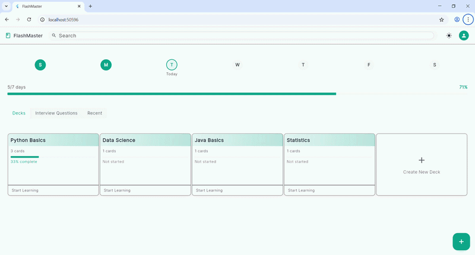

# flutter_flashcard_app

## Getting Started

**Flutter Flashcard App with LLM Integration**
This project provides a Flutter flashcard application with a custom Python REST API backend that leverages large language models (LLMs) for grading and suggestions.



**Features**
- **Flashcard Interface**: Interactive flashcards with flip animation
- **Dual Input Methods**: Type answers or use speech-to-text
- **LLM-Based Grading**: Submit answers for intelligent grading by an LL
- **Intelligent Suggestions**: Receive actionable feedback and improvement suggestions

**Project Structure**
- **The project is divided into two main parts:**
- **Flutter App**: The mobile application for users to interact with flashcards
- **Python Backend**: REST API that integrates with LLMs for grading and suggestions

### Flutter App Structure

```
/client
├── lib/
│   ├── models/
│   │   ├── flashcard.dart       // Flashcard data structure
│   │   ├── answer.dart          // User answer details
│   │   └── suggestion.dart      // Improvement suggestions
│   ├── screens/
│   │   ├── flashcard_screen.dart // Main flashcard UI
│   │   └── result_screen.dart   // Grading and suggestions UI
│   ├── services/
│   │   ├── speech_to_text_service.dart // Speech recognition
│   │   └── api_service.dart     // API calls
│   ├── widgets/
│   │   ├── flashcard_widget.dart // Flashcard component
│   │   ├── answer_input_widget.dart // Text/speech input
│   │   └── suggestions_widget.dart // Feedback display
│   └── utils/
│       ├── constants.dart        // Constants and configuration
│       └── helpers.dart          // Utility functions
└── pubspec.yaml                  // Flutter dependencies
```

