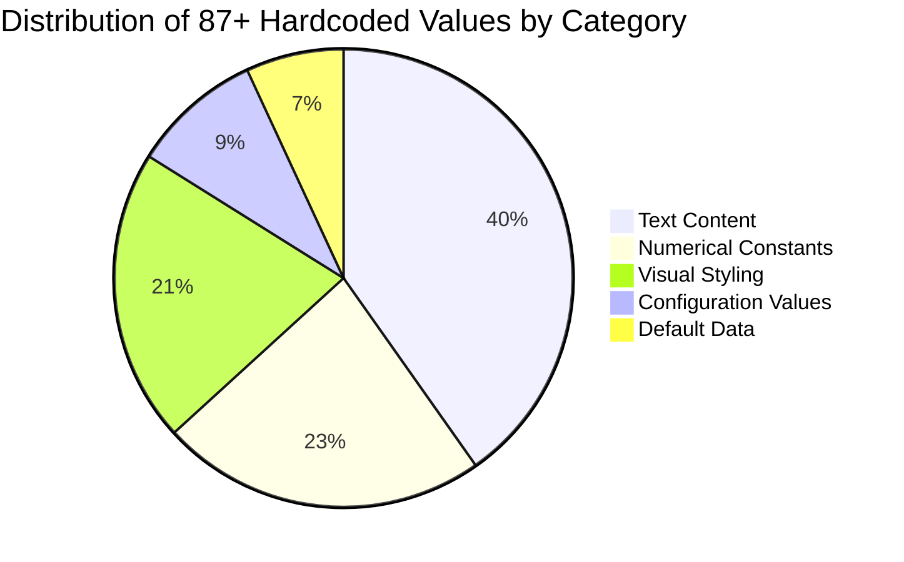
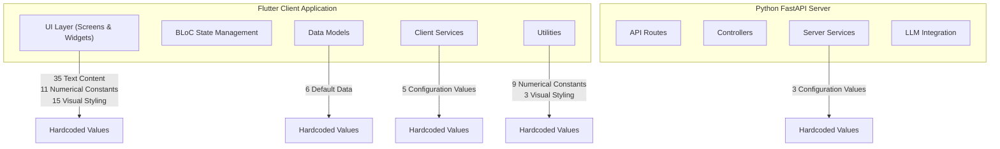
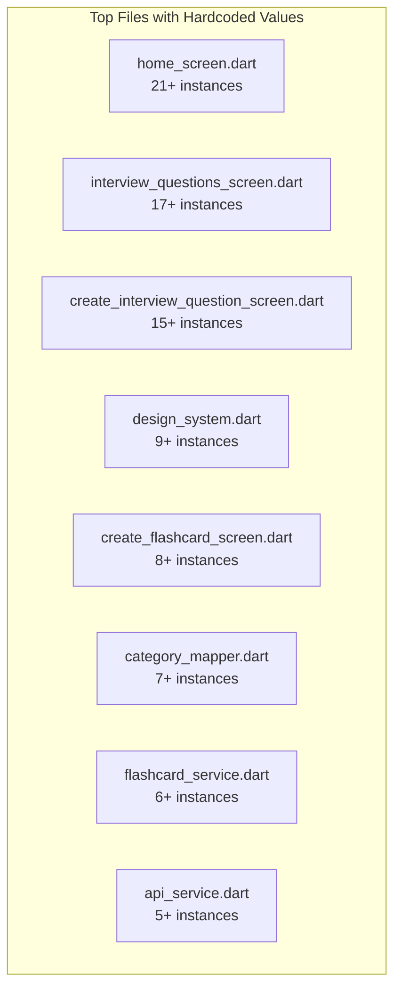
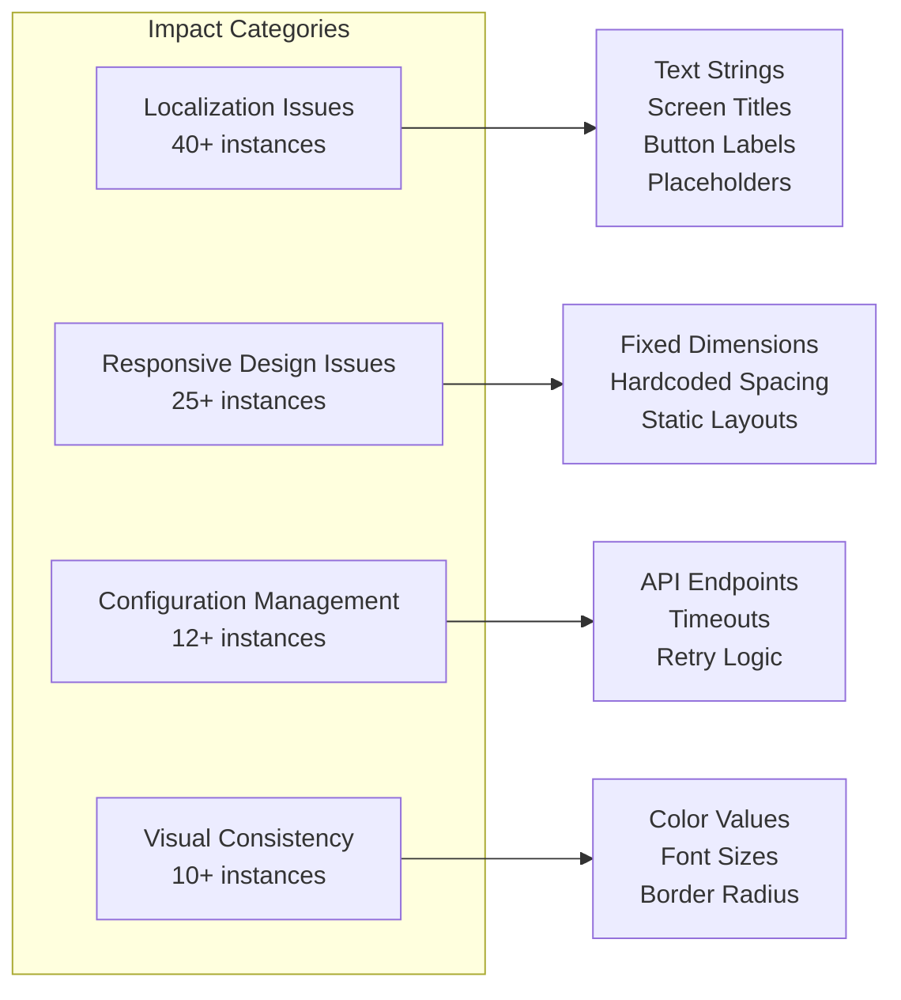
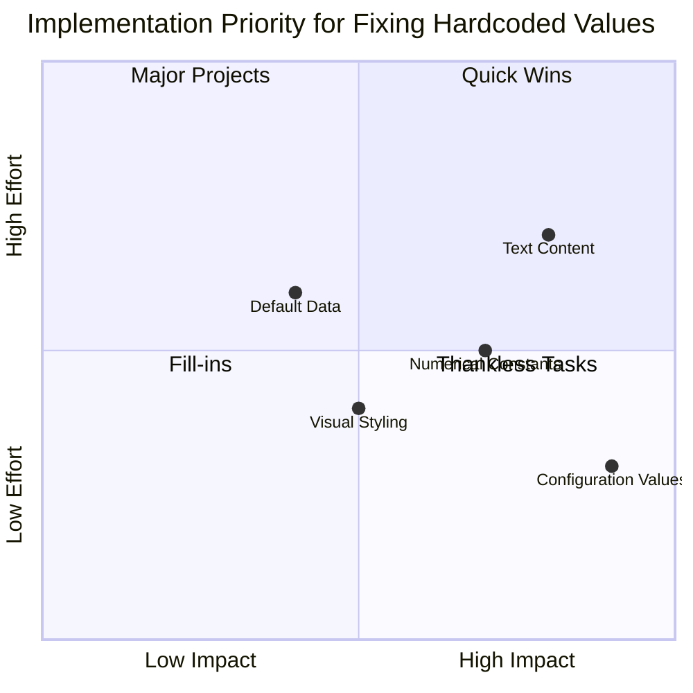
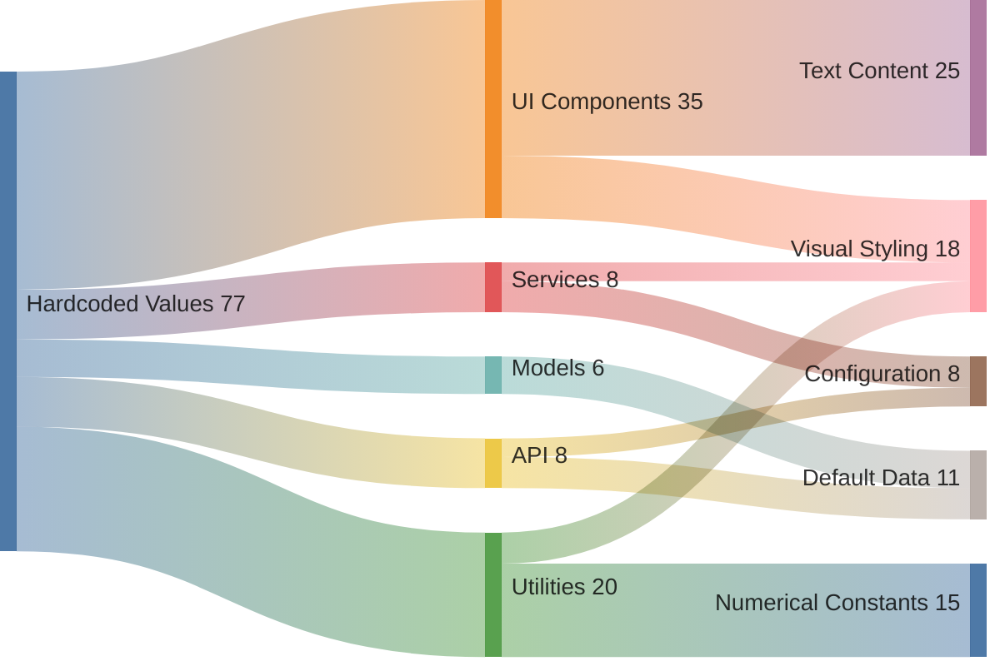

# Visual Analysis of Hardcoded Values in FlashMaster Application

## Distribution of Hardcoded Values by Category

## Locations of Hardcoded Values in Application Architecture

## Hardcoded Values by File Distribution

## Hardcoded Values by Impact Category

## Implementation Priority Map

## Category Distribution Across Application Components

The diagrams above visually represent the distribution and impact of hardcoded values throughout the FlashMaster application. The majority of hardcoded values are concentrated in the UI layer, particularly in text content, which presents significant challenges for localization. The implementation priority chart suggests focusing first on configuration values as they are high-impact but relatively low-effort to fix.
