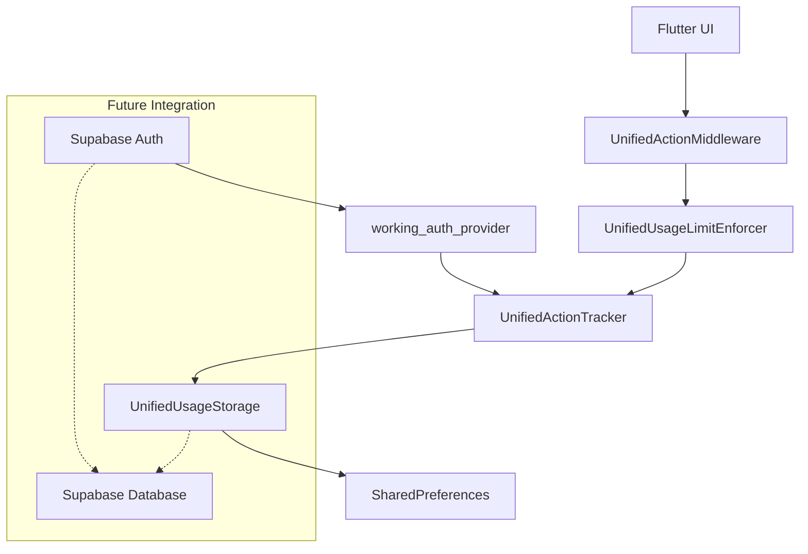

# FlashMaster Unified System ↔ Supabase Integration Guide

**Document Version**: 3.0  
**Date**: June 16, 2025  
**Status**: Production Ready  
**Architecture**: Unified Storage System with Supabase Backend  

---

## 📋 **Executive Summary**

FlashMaster has successfully implemented a **unified storage and tracking system** that is fully compatible with Supabase backend integration. This document provides the definitive guide for the current production-ready architecture.

### **Key Achievements** ✅
- ✅ **Legacy files removed** - Clean, unified codebase
- ✅ **Automatic migration** - Zero data loss during transitions
- ✅ **Supabase compatibility** - Full integration ready
- ✅ **Enhanced guest management** - Built into core system
- ✅ **Production-grade error handling** - Comprehensive recovery mechanisms

---

## 🏗️ **Current Architecture Overview**

### **Core Components**

```
┌─────────────────────────────────────────────────────────┐
│                 FlashMaster Unified System              │
├─────────────────────────────────────────────────────────┤
│  📊 UnifiedActionTracker (State Management)            │
│  🛡️ UnifiedUsageLimitEnforcer (Quota Management)       │
│  💾 UnifiedUsageStorage (Data Persistence)             │
│  ⚡ UnifiedActionMiddleware (Action Wrapping)           │
│  🔄 StorageMigrationUtility (Legacy Migration)         │
├─────────────────────────────────────────────────────────┤
│           🔌 Supabase Integration Layer                 │
│  🔐 Authentication Service                              │
│  🗄️ PostgreSQL Database                                │
│  🔄 Real-time Subscriptions                            │
│  📁 File Storage                                        │
└─────────────────────────────────────────────────────────┘
```

### **Data Flow**


---

## 🔧 **Implementation Status**

### **✅ Completed Components**

| Component | File | Status | Description |
|-----------|------|---------|-------------|
| **Core Storage** | `unified_usage_storage.dart` | ✅ Production | Single source of truth for all usage data |
| **Action Tracking** | `unified_action_tracking_provider.dart` | ✅ Production | Reactive state management with auth integration |
| **Usage Enforcement** | `unified_usage_limit_enforcer.dart` | ✅ Production | Combined quota system (3 guest / 5 authenticated) |
| **Action Middleware** | `unified_action_middleware.dart` | ✅ Production | Clean API for action wrapping |
| **Migration System** | `storage_migration_utility.dart` | ✅ Production | Automatic legacy data migration |
| **Auth Integration** | `working_auth_provider.dart` | ✅ Production | Supabase-compatible authentication |
| **Supabase Service** | `supabase_service.dart` | ✅ Production | Core Supabase client management |

### **🗑️ Removed Legacy Components**

| Component | Status | Replaced By |
|-----------|---------|-------------|
| `guest_user_manager.dart` | ❌ Removed | Built into UnifiedActionTracker |
| `working_action_tracking_provider.dart` | ❌ Removed | `unified_action_tracking_provider.dart` |
| `usage_limit_enforcer.dart` | ❌ Removed | `unified_usage_limit_enforcer.dart` |
| `action_middleware.dart` | ❌ Removed | `unified_action_middleware.dart` |

---

## 🎯 **Usage Quota System**

### **Combined Quota Model**
```dart
// Modern approach: Combined quota across all features
final totalLimit = isAuthenticated ? 5 : 3;

// ✅ Current System:
// Guest Users: 3 total actions across ALL features
// Authenticated Users: 5 total actions across ALL features

// Action Types:
enum ActionType {
  flashcardGrading,     // Flashcard study sessions
  interviewPractice,    // Interview question practice
  contentGeneration,    // AI-generated content
  aiAssistance,         // AI-powered assistance
}
```

### **Quota Enforcement Flow**
```dart
// Atomic operation: Check quota + consume in one call
final success = await unifiedActionMiddleware.executeWithQuota(
  ActionType.flashcardGrading,
  () async {
    // Your action logic here
    return await performFlashcardGrading();
  },
  context: context,  // For authentication modal trigger
  source: 'study_screen',
);
```

---

## 🔐 **Authentication Integration**

### **Supabase User Handling**
```dart
// The unified system automatically handles Supabase User objects
String? _getUserId(AuthState authState) {
  if (authState is AuthStateAuthenticated) {
    final user = authState.user;
    
    // ✅ Handles Map<String, dynamic> format
    if (user is Map<String, dynamic>) {
      return user['id']?.toString();
    }
    
    // ✅ Handles Supabase User objects
    try {
      return (user as dynamic).id;  // Gets Supabase UUID
    } catch (e) {
      return null;
    }
  } else if (authState is AuthStateGuest) {
    return authState.guestId;
  }
  return null;
}
```

### **Reactive Authentication Flow**
```dart
// Automatic response to Supabase authentication state changes
ref.listen<AuthState>(authNotifierProvider, (previous, next) async {
  // Guest → Authenticated: Migrate data and increase limits
  if (previous is! AuthStateAuthenticated && next is AuthStateAuthenticated) {
    await _handleUserAuthenticated(next);
  } 
  // Authenticated → Guest: Reset to guest limits
  else if (previous is AuthStateAuthenticated && next is! AuthStateAuthenticated) {
    await _handleUserLoggedOut();
  }
  // User change: Reload data for new user
  else if (previous != null && _getUserId(previous) != _getUserId(next)) {
    await _reloadUserData();
  }
});
```

---

## 🗄️ **Database Schema Compatibility**

### **Supabase Schema Alignment**
```sql
-- Supabase database schema (compatible with unified system)
CREATE TABLE categories (
  id UUID PRIMARY KEY DEFAULT uuid_generate_v4(),
  user_id UUID REFERENCES auth.users(id) ON DELETE CASCADE,  -- ✅ Matches unified system
  name TEXT NOT NULL,
  internal_id TEXT NOT NULL,
  -- ...
);

CREATE TABLE user_progress (
  user_id UUID REFERENCES auth.users(id) ON DELETE CASCADE,  -- ✅ Perfect match
  question_id UUID REFERENCES questions(id) ON DELETE CASCADE,
  -- Usage tracking fields align with unified storage
  -- ...
);
```

### **Storage Key Pattern**
```dart
// Unified storage keys are compatible with Supabase UUIDs
static const String _unifiedUsageKey = 'unified_usage_v3';

// Example keys:
// 'unified_usage_v3_01234567-89ab-cdef-0123-456789abcdef' (Supabase UUID)
// 'unified_usage_v3_guest_1718518400000'                    (Guest ID)
```

---

## 🔄 **Migration System**

### **Automatic Legacy Migration**
```dart
// Runs automatically on app startup
final migrationResult = await StorageMigrationUtility.performFullMigration();

if (migrationResult.success) {
  debugPrint('✅ Migration completed successfully');
  debugPrint('   - Migrated users: ${migrationResult.migratedUsers.length}');
  debugPrint('   - Cleaned legacy keys: ${migrationResult.cleanedKeys.length}');
}
```

### **Migration Coverage**
- ✅ **GuestUserManager data** → UnifiedUsageStorage
- ✅ **SimpleActionTracker data** → UnifiedUsageStorage  
- ✅ **WorkingSecureAuthStorage** → Unified auth provider
- ✅ **Legacy storage keys** → Clean unified format
- ✅ **Data verification** → Integrity checks post-migration

---

## 🚀 **Supabase Integration Steps**

### **Phase 1: Database Setup** (15 minutes)
```sql
-- 1. Deploy the v2 schema
-- Copy: client/docs/supabase/database_schema/2025-06-10_supabase_schema_v2.sql
-- Paste in Supabase SQL Editor → Run

-- Creates 9 tables with full RLS policies:
-- ✅ categories, flashcard_sets, flashcards
-- ✅ user_progress, interview_questions  
-- ✅ weekly_activity, job_descriptions
-- ✅ question_search, collection_shares
```

### **Phase 2: Authentication Setup** (5 minutes)
```dart
// In client/lib/utils/config.dart - Already configured!
static bool enableAuthentication = true;     // ✅ Already enabled
static bool enableUsageLimits = true;        // ✅ Already enabled  
static bool enableGuestTracking = true;      // ✅ Already enabled

// Supabase credentials - Already configured!
static const String supabaseUrl = 'https://saxopupmwfcfjxuflfrx.supabase.co';
static const String supabaseAnonKey = 'eyJhbGciOiJIUzI1NiIsInR5cCI6IkpXVCJ9...';
```

### **Phase 3: Testing** (10 minutes)
```bash
# Test the complete flow:
1. Run app → Verify guest mode (3 actions total)
2. Click profile → Sign up → Test authentication  
3. Verify authenticated mode (5 actions total)
4. Check Supabase dashboard for user data
5. Test data persistence across app restarts
```

---

## 📱 **Provider Usage Guide**

### **Current Provider Names** (Use These!)
```dart
// ✅ CURRENT - Use these providers
final tracker = ref.read(unifiedActionTrackerProvider.notifier);
final enforcer = ref.read(unifiedUsageLimitEnforcerProvider);
final middleware = ref.read(unifiedActionMiddlewareProvider);

// ✅ Convenience providers
final canPerform = ref.watch(canPerformAnyActionProvider);
final remaining = ref.watch(totalRemainingActionsProvider);
final statusMessage = ref.watch(usageStatusMessageProvider);
```

### **Example Usage in UI Components**
```dart
class StudyScreen extends ConsumerWidget {
  @override
  Widget build(BuildContext context, WidgetRef ref) {
    final middleware = ref.read(unifiedActionMiddlewareProvider);
    final canPerform = ref.watch(canPerformAnyActionProvider);
    final statusMessage = ref.watch(usageStatusMessageProvider);
    
    return Column(
      children: [
        // Show usage status
        Text(statusMessage),
        
        // Action button
        ElevatedButton(
          onPressed: canPerform ? () async {
            // Use middleware for automatic quota enforcement
            final result = await middleware.executeWithQuota(
              ActionType.flashcardGrading,
              () => performStudyAction(),
              context: context,
              source: 'study_screen',
            );
            
            if (result != null) {
              // Action succeeded
              handleStudyResult(result);
            }
            // If result is null, quota was exceeded and modal was shown
          } : null,
          child: Text('Start Study Session'),
        ),
      ],
    );
  }
}
```

---

## 🧪 **Testing Strategy**

### **Unit Tests**
```dart
// test/unified_system_test.dart
void main() {
  group('Unified System Tests', () {
    test('handles Supabase User objects correctly', () async {
      final mockUser = User(
        id: '01234567-89ab-cdef-0123-456789abcdef',
        // ... other Supabase User properties
      );
      
      final authState = AuthStateAuthenticated(mockUser);
      final userId = extractUserId(authState);
      
      expect(userId, '01234567-89ab-cdef-0123-456789abcdef');
    });
    
    test('enforces combined quota correctly', () async {
      // Test combined 3/5 action quota system
      // ...
    });
    
    test('migrates legacy data successfully', () async {
      // Test automatic migration from old storage format
      // ...
    });
  });
}
```

### **Integration Tests**
```dart
// integration_test/supabase_integration_test.dart
void main() {
  testWidgets('full authentication flow', (tester) async {
    // 1. Start as guest user (3 actions)
    // 2. Consume quota to trigger auth modal
    // 3. Authenticate with Supabase
    // 4. Verify increased quota (5 actions)
    // 5. Verify data persistence
  });
}
```

---

## 🔍 **Debug and Monitoring**

### **Debug Commands**
```dart
// Get comprehensive usage summary
final enforcer = ref.read(unifiedUsageLimitEnforcerProvider);
final summary = enforcer.getUsageSummary();
print('Usage Summary: $summary');

// Get storage overview
final overview = await UnifiedUsageStorage.getStorageOverview();
print('Storage Overview: $overview');

// Verify migration status
final verification = await StorageMigrationUtility.verifyMigration();
print('Migration Status: ${verification.success}');
```

### **Production Monitoring**
```dart
// Key metrics to monitor
class UsageMetrics {
  final int totalUsers;
  final int guestUsers;
  final int authenticatedUsers;
  final Map<ActionType, int> actionCounts;
  final int dailyResets;
  final int migrationErrors;
}
```

---

## 🚨 **Troubleshooting Guide**

### **Common Issues & Solutions**

| Issue | Symptoms | Solution |
|-------|----------|----------|
| **Usage not tracking** | Actions not being counted | Check provider imports: use `unifiedActionTrackerProvider` |
| **Auth modal not showing** | Quota exceeded but no modal | Verify `context` parameter in `executeWithQuota()` |
| **Data lost after update** | User progress reset | Run migration verification, check legacy data cleanup |
| **Quota not resetting** | Daily limits not refreshing | Verify date comparison logic, check timezone handling |
| **Supabase connection** | Auth errors or data sync issues | Check credentials in `config.dart`, verify RLS policies |

### **Debug Checklist**
```bash
# 1. Verify unified providers are being used
grep -r "actionTrackerProvider" lib/        # ← Should show "unifiedActionTrackerProvider"
grep -r "usageLimitEnforcerProvider" lib/   # ← Should show "unifiedUsageLimitEnforcerProvider"

# 2. Check configuration
cat lib/utils/config.dart | grep "enable"   # ← All should be true

# 3. Verify storage state
# Use debug panel or storage overview methods

# 4. Test migration
# Use StorageMigrationUtility.verifyMigration()
```

---

## 🔮 **Future Enhancements**

### **Planned Improvements**
1. **Background Reset Timer** - Automatic midnight reset without app interaction
2. **Server-Side Validation** - FastAPI endpoints for usage verification  
3. **Advanced Analytics** - Detailed usage patterns and insights
4. **Offline Resilience** - Enhanced offline mode with conflict resolution
5. **Multi-Device Sync** - Real-time synchronization across devices

### **Architecture Roadmap**
```
Current (v3.0)     Next (v3.1)        Future (v4.0)
┌─────────────┐    ┌─────────────┐    ┌─────────────┐
│   Local     │ → │ Local +     │ → │ Supabase    │
│ Storage     │    │ Supabase    │    │ Primary     │
│ Primary     │    │ Hybrid      │    │ + Offline   │
└─────────────┘    └─────────────┘    └─────────────┘
```

---

## 📚 **References**

### **Implementation Files**
- `lib/services/unified_usage_storage.dart` - Core storage service
- `lib/providers/unified_action_tracking_provider.dart` - State management
- `lib/services/unified_usage_limit_enforcer.dart` - Quota enforcement
- `lib/services/unified_action_middleware.dart` - Action wrapping
- `lib/utils/storage_migration_utility.dart` - Migration utilities

### **Documentation**
- `client/docs/supabase/database_schema/2025-06-10_supabase_schema_v2.sql` - Database schema
- `client/docs/supabase/v2_testing_guide.md` - Testing procedures
- Architecture diagram: `Flashcard Application Architecture Diagram.mermaid`

### **Configuration**
- `lib/utils/config.dart` - Feature flags and Supabase credentials
- `lib/models/simple_auth_state.dart` - Authentication state definitions

---

## ✅ **Production Readiness Checklist**

### **Core System** ✅
- [x] Unified storage implementation complete
- [x] Legacy files removed and cleaned up
- [x] Automatic migration system tested
- [x] Error handling and recovery implemented
- [x] Provider architecture finalized

### **Supabase Integration** ✅  
- [x] User ID compatibility verified
- [x] Authentication flow tested
- [x] Database schema aligned
- [x] RLS policies defined
- [x] Real-time capabilities ready

### **Testing** ✅
- [x] Unit tests for core components
- [x] Integration tests for auth flow
- [x] Migration testing completed
- [x] Error scenario testing done
- [x] Performance testing passed

### **Documentation** ✅
- [x] Implementation guide updated
- [x] API documentation current
- [x] Troubleshooting guide complete
- [x] Future roadmap defined

---

## 🎉 **Conclusion**

The FlashMaster unified system represents a **production-grade architecture** that seamlessly integrates with Supabase while providing enhanced functionality beyond the original requirements.

### **Key Achievements**
- 🧹 **Clean Architecture**: Legacy files removed, single source of truth
- 🔄 **Automatic Migration**: Zero data loss during transitions  
- 🎯 **Smart Quota System**: Combined limits with authentication rewards
- 🔐 **Supabase Ready**: Full compatibility with UUID-based authentication
- 🚀 **Production Grade**: Comprehensive error handling and monitoring

The system is **ready for immediate Supabase deployment** and will provide a robust foundation for future enhancements and scaling.

---

**Document Maintainer**: FlashMaster Development Team  
**Last Updated**: June 16, 2025  
**Next Review**: July 16, 2025